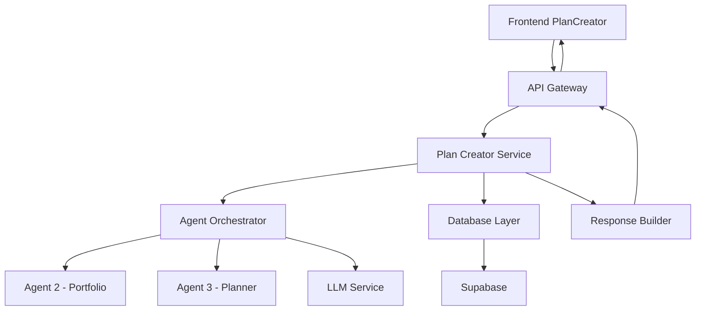

# Plan Creator API Integration Guide

## Overview

This document provides detailed information about the API integration for the Plan Creator system, including endpoint specifications, request/response formats, error handling, and integration patterns.

## Table of Contents

1. [API Architecture](#api-architecture)
2. [Authentication & Authorization](#authentication--authorization)
3. [Endpoint Specifications](#endpoint-specifications)
4. [Request/Response Formats](#requestresponse-formats)
5. [Error Handling](#error-handling)
6. [Integration Patterns](#integration-patterns)
7. [Rate Limiting](#rate-limiting)
8. [Performance Optimization](#performance-optimization)
9. [Testing & Debugging](#testing--debugging)

---

## API Architecture

### Service Structure

```
Frontend Application
├── PlanCreator Component (React)
├── API Service Layer
└── Error Handling & State Management

Backend API Server
├── Plan Creator Routes (/plan-creator/*)
├── Agent Integration Layer
├── Database Service (Supabase)
└── External AI Services (Mistral LLM)
```

### Data Flow Architecture



---

## Authentication & Authorization

### User Identification

The Plan Creator uses user ID-based authentication stored in browser localStorage:

```javascript
// Frontend authentication check
const userId = localStorage.getItem("userId") || "anonymous_user";

// API call with user identification
url.searchParams.append("user_id", userId);
```

### Security Considerations

- **User ID Validation**: Backend validates user ID format and existence
- **Data Isolation**: Plans are isolated by user ID
- **Anonymous Access**: Supports anonymous users with limited functionality
- **Rate Limiting**: Applied per user ID to prevent abuse

---

## Endpoint Specifications

### Primary Endpoint: Create Comprehensive Plan

**POST** `/api/v1/plan-creator/create-comprehensive-plan`

#### Query Parameters

| Parameter | Type | Required | Default | Description |
|-----------|------|----------|---------|-------------|
| `user_id` | string | Yes | - | User identifier from localStorage |
| `financial_goals` | string | No | null | User's financial goals in natural language |
| `investment_preferences` | string | No | null | Investment strategy preferences |
| `goal_type` | string | No | "GENERAL" | RETIREMENT, HOUSE, EDUCATION, GENERAL |
| `risk_level` | string | No | "BALANCED" | CONSERVATIVE, BALANCED, AGGRESSIVE |
| `time_horizon` | integer | No | 10 | Investment time horizon in years |
| `target_amount` | float | No | 100000.0 | Target investment amount in USD |

#### Request Example

```javascript
const url = new URL("http://localhost:8000/api/v1/plan-creator/create-comprehensive-plan");
url.searchParams.append("user_id", "b68cd608-65d2-42c6-9174-8c76025dc3ef");
url.searchParams.append("financial_goals", "Save for retirement in 30 years");
url.searchParams.append("investment_preferences", "Moderate risk, prefer ETFs");
url.searchParams.append("goal_type", "RETIREMENT");
url.searchParams.append("risk_level", "BALANCED");
url.searchParams.append("time_horizon", "30");
url.searchParams.append("target_amount", "500000");

const response = await fetch(url.toString(), {
  method: "POST",
  headers: {
    "accept": "application/json",
    "Content-Type": "application/json"
  }
});
```

#### Response Format

```json
{
  "success": true,
  "plan_id": "ef530167-89b9-4379-8693-17367688f813",
  "user_id": "b68cd608-65d2-42c6-9174-8c76025dc3ef",
  "user_input": {
    "financial_goals": "Save for retirement in 30 years",
    "investment_preferences": "Moderate risk, prefer ETFs",
    "goal_type": "RETIREMENT",
    "risk_level": "BALANCED",
    "time_horizon": 30,
    "target_amount": 500000
  },
  "agent_outputs": {
    "agent_2_portfolio": {
      "portfolio": {
        "allocations": {
          "stocks": 0.70,
          "bonds": 0.25,
          "alternatives": 0.05
        },
        "expected_return": 0.075,
        "risk_metrics": {
          "volatility": 0.12,
          "sharpe_ratio": 0.63
        }
      },
      "risk_level": 3,
      "goal_type": "retirement",
      "timestamp": "2024-01-15T10:30:00Z",
      "agent": "portfolio_agent",
      "status": "success"
    },
    "agent_3_planner": {
      "parsed_goal": {
        "goal_type": "RETIREMENT",
        "target_amount": 500000,
        "time_horizon": 30,
        "confidence_score": 0.92,
        "extracted_keywords": ["retirement", "save", "$500,000", "30 years"]
      },
      "goal_text": "Save for retirement in 30 years",
      "timestamp": "2024-01-15T10:30:00Z",
      "agent": "planner_agent",
      "status": "success"
    }
  },
  "investment_plan": {
    "investment_plan": {
      "monthly_contribution": 856,
      "asset_allocation": {
        "stocks": 70,
        "bonds": 25,
        "alternatives": 5
      },
      "milestones": [
        {
          "timeline": "Year 5",
          "checkpoint": "Review allocation, consider reducing equity to 75%"
        },
        {
          "timeline": "Year 15",
          "checkpoint": "Mid-career review, adjust for income changes"
        },
        {
          "timeline": "Year 25",
          "checkpoint": "Pre-retirement, shift to conservative allocation"
        }
      ],
      "risk_considerations": {
        "market_volatility": "Portfolio may experience significant fluctuations during market downturns",
        "inflation_risk": "Consider inflation impact on long-term purchasing power",
        "sequence_risk": "Risk of poor returns early in retirement"
      }
    }
  },
  "created_at": "2024-01-15T10:30:00Z",
  "processing_status": "COMPLETED"
}
```

### Supporting Endpoints

#### Get User Plans

**GET** `/api/v1/plan-creator/plans/{user_id}`

**Query Parameters:**
- `active_only` (boolean, optional): Return only active plans (default: true)

**Response:**
```json
{
  "success": true,
  "user_id": "b68cd608-65d2-42c6-9174-8c76025dc3ef",
  "plans": [
    {
      "id": "plan-uuid-1",
      "plan_name": "Retirement Plan 2055",
      "plan_type": "RETIREMENT",
      "target_amount": 500000,
      "created_at": "2024-01-15T10:30:00Z",
      "is_favorite": true
    }
  ],
  "total_plans": 1
}
```

#### Get Plan Details

**GET** `/api/v1/plan-creator/plan/{plan_id}`

**Response:**
```json
{
  "success": true,
  "plan": {
    "id": "ef530167-89b9-4379-8693-17367688f813",
    "user_id": "b68cd608-65d2-42c6-9174-8c76025dc3ef",
    "financial_goals": "Save for retirement in 30 years",
    "investment_preferences": "Moderate risk, prefer ETFs",
    "plan_data": { /* Complete plan object */ },
    "agent_2_data": { /* Portfolio agent output */ },
    "agent_3_data": { /* Planner agent output */ },
    "processing_status": "COMPLETED",
    "created_at": "2024-01-15T10:30:00Z",
    "updated_at": "2024-01-15T10:35:00Z"
  }
}
```

#### Toggle Favorite Status

**PATCH** `/api/v1/plan-creator/plan/{plan_id}/favorite`

**Request Body:**
```json
{
  "is_favorite": true
}
```

**Response:**
```json
{
  "success": true,
  "plan_id": "ef530167-89b9-4379-8693-17367688f813",
  "is_favorite": true
}
```

#### Deactivate Plan

**DELETE** `/api/v1/plan-creator/plan/{plan_id}`

**Response:**
```json
{
  "success": true,
  "plan_id": "ef530167-89b9-4379-8693-17367688f813",
  "is_active": false,
  "message": "Plan deactivated successfully"
}
```

#### Health Check

**GET** `/api/v1/plan-creator/health`

**Response:**
```json
{
  "status": "healthy",
  "timestamp": "2024-01-15T10:30:00Z",
  "components": {
    "database": "healthy",
    "portfolio_agent": "healthy",
    "planner_agent": "healthy"
  }
}
```

---

## Request/Response Formats

### Content Types

- **Request**: `application/json`
- **Response**: `application/json`
- **Character Encoding**: UTF-8

### Common Headers

```javascript
const headers = {
  "accept": "application/json",
  "Content-Type": "application/json"
};
```

### Response Status Codes

| Code | Meaning | Description |
|------|---------|-------------|
| 200 | Success | Request completed successfully |
| 400 | Bad Request | Invalid parameters or missing required fields |
| 404 | Not Found | Resource not found (plan, user, etc.) |
| 429 | Too Many Requests | Rate limit exceeded |
| 500 | Internal Server Error | Server-side error during processing |

---

## Error Handling

### Error Response Structure

```json
{
  "error": {
    "code": 500,
    "message": {
      "error": "plan_creation_failed",
      "message": "Detailed error description",
      "plan_id": "ef530167-89b9-4379-8693-17367688f813",
      "user_id": "b68cd608-65d2-42c6-9174-8c76025dc3ef"
    },
    "timestamp": "2025-09-20T23:23:17.015523",
    "path": "/api/v1/plan-creator/create-comprehensive-plan",
    "method": "POST"
  }
}
```

### Frontend Error Handling

```javascript
const handleSubmit = useCallback(async (event) => {
  event.preventDefault();
  setLoading(true);
  setError(null);
  setResponse(null);

  try {
    const response = await fetch(url.toString(), {
      method: "POST",
      headers: {
        "accept": "application/json",
        "Content-Type": "application/json"
      }
    });

    if (!response.ok) {
      const errorData = await response.text();
      console.error("API Error:", errorData);
      throw new Error(`API Error ${response.status}: ${errorData}`);
    }

    const data = await response.json();
    setResponse(data);

  } catch (error) {
    console.error("Error creating plan:", error);
    setError(`Failed to create plan: ${error.message}. Please check the console for details.`);
  } finally {
    setLoading(false);
  }
}, []);
```

### Common Error Scenarios

#### 1. Database Table Missing

**Error:**
```json
{
  "error": {
    "code": 500,
    "message": {
      "error": "plan_creation_failed",
      "message": "Could not find the table 'public.investment_plans' in the schema cache"
    }
  }
}
```

**Solution:** Create the database table using the provided SQL script.

#### 2. Invalid User ID

**Error:**
```json
{
  "error": {
    "code": 400,
    "message": {
      "error": "invalid_user_id",
      "message": "User ID is required"
    }
  }
}
```

**Solution:** Ensure user is logged in and user ID is stored in localStorage.

#### 3. Agent Service Unavailable

**Error:**
```json
{
  "agent_2_data": {
    "error": "Connection timeout",
    "status": "failed",
    "agent": "portfolio_agent"
  }
}
```

**Solution:** Check agent service availability and network connectivity.

### Error Recovery Strategies

1. **Retry Logic**: Implement exponential backoff for transient errors
2. **Fallback Handling**: Graceful degradation when agents fail
3. **User Feedback**: Clear error messages with actionable guidance
4. **Logging**: Comprehensive error logging for debugging

---

## Integration Patterns

### Frontend Integration

#### React Component Integration

```javascript
import React, { useState, useCallback } from "react";

const PlanCreator = () => {
  const [loading, setLoading] = useState(false);
  const [response, setResponse] = useState(null);
  const [error, setError] = useState(null);

  const createPlan = useCallback(async (goalData) => {
    setLoading(true);
    setError(null);

    try {
      const result = await planCreatorApi.createPlan(goalData);
      setResponse(result);
    } catch (err) {
      setError(err.message);
    } finally {
      setLoading(false);
    }
  }, []);

  return (
    <div>
      {/* UI Components */}
    </div>
  );
};
```

#### API Service Layer

```javascript
// services/planCreatorApi.js
class PlanCreatorAPI {
  constructor(baseURL = "http://localhost:8000") {
    this.baseURL = baseURL;
  }

  async createPlan(params) {
    const url = new URL(`${this.baseURL}/api/v1/plan-creator/create-comprehensive-plan`);

    Object.entries(params).forEach(([key, value]) => {
      if (value !== null && value !== undefined) {
        url.searchParams.append(key, value.toString());
      }
    });

    const response = await fetch(url.toString(), {
      method: "POST",
      headers: {
        "accept": "application/json",
        "Content-Type": "application/json"
      }
    });

    if (!response.ok) {
      const errorData = await response.text();
      throw new Error(`API Error ${response.status}: ${errorData}`);
    }

    return response.json();
  }

  async getUserPlans(userId, activeOnly = true) {
    const url = `${this.baseURL}/api/v1/plan-creator/plans/${userId}`;
    const params = new URLSearchParams({ active_only: activeOnly });

    const response = await fetch(`${url}?${params}`);
    return response.json();
  }

  async getPlanDetails(planId) {
    const response = await fetch(`${this.baseURL}/api/v1/plan-creator/plan/${planId}`);
    return response.json();
  }
}

export const planCreatorApi = new PlanCreatorAPI();
```

### Backend Integration

#### Route Registration

```python
# api/api.py
from api.routes import plan_creator

api_router.include_router(
    plan_creator.router,
    prefix="/plan-creator",
    tags=["Plan Creator"]
)
```

#### Agent Integration Pattern

```python
# api/routes/plan_creator.py
async def create_comprehensive_plan(user_id: str, ...):
    try:
        # Step 1: Initialize plan record
        plan_id = str(uuid.uuid4())
        initial_data = {...}
        supabase.table("investment_plans").insert(initial_data).execute()

        # Step 2: Run agents in parallel
        agent_2_task = asyncio.create_task(
            portfolio_agent.build_portfolio(risk_level, goal_type)
        )
        agent_3_task = asyncio.create_task(
            planner_agent.parse_goal(financial_goals)
        )

        agent_2_output = await agent_2_task
        agent_3_output = await agent_3_task

        # Step 3: Generate final plan
        final_plan = await create_plan_with_mistral(goal, strategy, user_id)

        # Step 4: Update database
        complete_plan = {
            "agent_outputs": {...},
            "investment_plan": final_plan,
            "processing_status": "COMPLETED"
        }

        supabase.table("investment_plans").update(complete_plan).eq("id", plan_id).execute()

        return complete_plan

    except Exception as e:
        # Error handling and cleanup
        supabase.table("investment_plans").update({"processing_status": "FAILED"}).eq("id", plan_id).execute()
        raise HTTPException(status_code=500, detail=error_details)
```

---

## Rate Limiting

### Current Limits

- **Basic Tier**: 50 requests/day, 10/hour, 3/minute
- **Premium Tier**: 200 requests/day, 50/hour, 10/minute
- **Enterprise Tier**: 1000 requests/day, 200/hour, 50/minute

### Rate Limit Headers

Response includes rate limiting information:

```
X-RateLimit-Limit: 50
X-RateLimit-Remaining: 49
X-RateLimit-Reset: 1640995200
```

### Handling Rate Limits

```javascript
async function createPlanWithRetry(params, maxRetries = 3) {
  for (let attempt = 0; attempt < maxRetries; attempt++) {
    try {
      return await planCreatorApi.createPlan(params);
    } catch (error) {
      if (error.status === 429 && attempt < maxRetries - 1) {
        const retryAfter = error.headers?.get('Retry-After') || Math.pow(2, attempt);
        await new Promise(resolve => setTimeout(resolve, retryAfter * 1000));
        continue;
      }
      throw error;
    }
  }
}
```

---

## Performance Optimization

### Frontend Optimizations

1. **Request Debouncing**: Prevent multiple simultaneous requests
2. **Caching**: Cache plan results for repeat access
3. **Lazy Loading**: Load plan details on demand
4. **Compression**: Enable gzip compression

```javascript
// Debounced plan creation
const debouncedCreatePlan = useMemo(
  () => debounce(createPlan, 500),
  []
);

// Result caching
const planCache = new Map();
const getCachedPlan = (planId) => {
  if (planCache.has(planId)) {
    return planCache.get(planId);
  }
  return planCreatorApi.getPlanDetails(planId).then(plan => {
    planCache.set(planId, plan);
    return plan;
  });
};
```

### Backend Optimizations

1. **Database Indexing**: Optimized queries with proper indexes
2. **Connection Pooling**: Efficient database connections
3. **Agent Parallelization**: Run agents concurrently
4. **Response Caching**: Cache expensive computations

```python
# Parallel agent execution
async def run_agents_parallel(goal_data):
    tasks = [
        asyncio.create_task(portfolio_agent.build_portfolio(...)),
        asyncio.create_task(planner_agent.parse_goal(...))
    ]

    results = await asyncio.gather(*tasks, return_exceptions=True)
    return process_agent_results(results)
```

---

## Testing & Debugging

### API Testing

#### Unit Tests

```javascript
// tests/planCreatorApi.test.js
describe('PlanCreatorAPI', () => {
  test('creates plan with valid parameters', async () => {
    const params = {
      user_id: 'test-user',
      financial_goals: 'Test goal',
      risk_level: 'BALANCED'
    };

    const result = await planCreatorApi.createPlan(params);

    expect(result.success).toBe(true);
    expect(result.plan_id).toBeDefined();
    expect(result.investment_plan).toBeDefined();
  });

  test('handles missing user_id error', async () => {
    const params = { financial_goals: 'Test goal' };

    await expect(planCreatorApi.createPlan(params))
      .rejects.toThrow('User ID is required');
  });
});
```

#### Integration Tests

```python
# tests/test_plan_creator.py
import pytest
from fastapi.testclient import TestClient

def test_create_comprehensive_plan(client: TestClient):
    response = client.post(
        "/api/v1/plan-creator/create-comprehensive-plan",
        params={
            "user_id": "test-user-123",
            "financial_goals": "Save for retirement",
            "risk_level": "BALANCED"
        }
    )

    assert response.status_code == 200
    data = response.json()
    assert data["success"] is True
    assert "plan_id" in data
    assert "investment_plan" in data
```

### Debugging Tools

#### Frontend Debugging

```javascript
// Enable detailed logging
const DEBUG = process.env.NODE_ENV === 'development';

const logApiCall = (url, params, response) => {
  if (DEBUG) {
    console.group('🔍 Plan Creator API Call');
    console.log('URL:', url.toString());
    console.log('Parameters:', params);
    console.log('Response:', response);
    console.groupEnd();
  }
};
```

#### Backend Debugging

```python
import logging

logger = logging.getLogger(__name__)

async def create_comprehensive_plan(...):
    logger.info(f"Creating plan for user {user_id}")
    logger.debug(f"Parameters: {locals()}")

    try:
        # Plan creation logic
        logger.info(f"Plan {plan_id} created successfully")
    except Exception as e:
        logger.error(f"Plan creation failed: {e}", exc_info=True)
        raise
```

### Monitoring & Metrics

Track these key metrics:

- **Success Rate**: Percentage of successful plan creations
- **Response Time**: Average API response time
- **Agent Performance**: Individual agent success rates and timing
- **Error Rates**: Categorized error frequency
- **User Engagement**: Plan creation patterns and usage

```python
# metrics.py
from prometheus_client import Counter, Histogram

plan_creation_counter = Counter(
    'plan_creator_requests_total',
    'Total plan creation requests',
    ['status', 'user_tier']
)

plan_creation_duration = Histogram(
    'plan_creator_duration_seconds',
    'Time spent creating plans'
)
```

---

## Conclusion

This API integration guide provides comprehensive coverage of the Plan Creator system's API layer. By following these patterns and best practices, developers can effectively integrate with the Plan Creator service, handle errors gracefully, and build robust applications that leverage the multi-agent AI planning capabilities.

For specific implementation questions or advanced integration scenarios, refer to the main Plan Creator documentation or contact the development team.