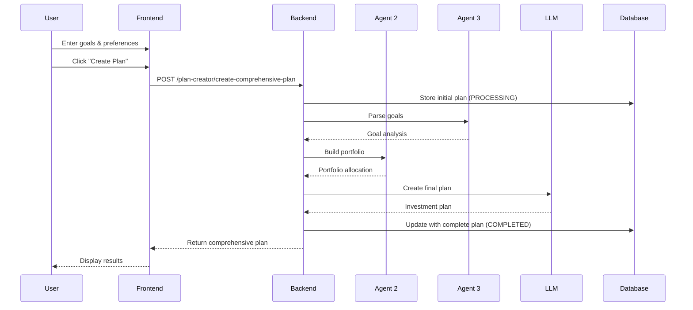

# Plan Creator - Comprehensive Documentation

## Overview

The **Plan Creator** is a comprehensive investment planning system that integrates multiple AI agents to create personalized investment plans for users. It combines user input with advanced AI analysis to generate detailed, actionable investment strategies.

## Table of Contents

1. [System Architecture](#system-architecture)
2. [User Interface](#user-interface)
3. [AI Agent Integration](#ai-agent-integration)
4. [Data Flow](#data-flow)
5. [Database Storage](#database-storage)
6. [API Endpoints](#api-endpoints)
7. [Error Handling](#error-handling)
8. [User Guide](#user-guide)
9. [Developer Guide](#developer-guide)
10. [Troubleshooting](#troubleshooting)

---

## System Architecture

### Components Overview

```
┌─────────────────┐    ┌──────────────────┐    ┌─────────────────┐
│   Frontend UI   │───▶│   Backend API    │───▶│   Supabase DB   │
│  (PlanCreator)  │    │ (/plan-creator)  │    │(investment_plans)│
└─────────────────┘    └──────────────────┘    └─────────────────┘
                              │
                              ▼
                    ┌────────────────────┐
                    │    AI Agents       │
                    │ ┌────────────────┐ │
                    │ │  Agent 2       │ │
                    │ │ (Portfolio)    │ │
                    │ └────────────────┘ │
                    │ ┌────────────────┐ │
                    │ │  Agent 3       │ │
                    │ │ (Planner)      │ │
                    │ └────────────────┘ │
                    │ ┌────────────────┐ │
                    │ │  LLM Service   │ │
                    │ │ (Mistral)      │ │
                    │ └────────────────┘ │
                    └────────────────────┘
```

### Key Features

- **🤖 Multi-Agent AI System**: Leverages specialized AI agents for different aspects of financial planning
- **💾 Persistent Storage**: All plans and user inputs are permanently stored in the database
- **🔄 Real-time Processing**: Plans are generated in real-time with live status updates
- **📊 Comprehensive Analysis**: Combines portfolio optimization, goal analysis, and market insights
- **🎯 Personalization**: Tailored recommendations based on user goals and preferences

---

## User Interface

### Component Location
```
frontend_neural/src/components/PlanCreator.jsx
```

### Form Fields

The Plan Creator interface includes:

1. **Financial Goals** (Optional)
   - Free-text input for describing financial objectives
   - Examples: "Save for retirement", "Buy a house in 5 years", "Build emergency fund"
   - Stored in database for future reference

2. **Investment Preferences** (Optional)
   - Free-text input for investment strategy preferences
   - Examples: "Conservative approach", "ESG investments only", "High growth potential"
   - Used by agents to customize recommendations

3. **Create Investment Plan Button**
   - Triggers the comprehensive plan generation process
   - Shows loading state during processing
   - Displays success/error messages

### UI States

| State | Description | User Experience |
|-------|-------------|-----------------|
| **Idle** | Ready for input | Form fields available, button enabled |
| **Loading** | Processing plan | Spinner animation, button disabled |
| **Success** | Plan created | Displays investment plan results |
| **Error** | Creation failed | Shows error message with details |

---

## AI Agent Integration

### Agent 2: Portfolio Agent (`PortfolioAgent`)

**Purpose**: Portfolio optimization and asset allocation

**Inputs**:
- Risk level (1-5 scale: Conservative to Aggressive)
- Goal type (retirement, house, education, general)
- Investment constraints (optional)

**Outputs**:
```json
{
  "portfolio": {
    "allocations": {
      "stocks": 0.70,
      "bonds": 0.25,
      "alternatives": 0.05
    },
    "expected_return": 0.075,
    "risk_metrics": {...}
  },
  "risk_level": 3,
  "goal_type": "retirement",
  "timestamp": "2024-01-15T10:30:00Z",
  "agent": "portfolio_agent",
  "status": "success"
}
```

### Agent 3: Planner Agent (`PlannerAgent`)

**Purpose**: Natural language goal interpretation and strategy generation

**Inputs**:
- Goal text (natural language)
- User financial context

**Outputs**:
```json
{
  "parsed_goal": {
    "goal_type": "RETIREMENT",
    "target_amount": 500000,
    "time_horizon": 30,
    "confidence_score": 0.92
  },
  "goal_text": "Save $500k for retirement in 30 years",
  "timestamp": "2024-01-15T10:30:00Z",
  "agent": "planner_agent",
  "status": "success"
}
```

### LLM Integration (Mistral)

**Purpose**: Final plan synthesis and natural language generation

**Process**:
1. Combines Agent 2 and Agent 3 outputs
2. Generates comprehensive investment plan
3. Creates actionable recommendations
4. Provides risk analysis and milestones

---

## Data Flow

### Step-by-Step Process



### Data Processing Pipeline

1. **Input Validation**
   - User ID validation
   - Optional field processing
   - Parameter sanitization

2. **Database Initialization**
   - Create plan record with PROCESSING status
   - Store user inputs (goals, preferences)
   - Generate unique plan ID

3. **Agent Execution** (Parallel Processing)
   - Agent 3: Goal interpretation and strategy
   - Agent 2: Portfolio optimization
   - Store individual agent outputs

4. **Plan Synthesis**
   - Combine agent outputs
   - Generate final plan using LLM
   - Create actionable recommendations

5. **Final Storage**
   - Update database with complete plan
   - Set status to COMPLETED
   - Return results to frontend

---

## Database Storage

### Table: `investment_plans`

Located in: `agent-api-backend/database/investment_plans_table.sql`

#### Schema

| Column | Type | Description |
|--------|------|-------------|
| `id` | UUID | Primary key (auto-generated) |
| `user_id` | UUID | Foreign key to users table |
| `financial_goals` | TEXT | User's financial goals input |
| `investment_preferences` | TEXT | User's investment preferences |
| `plan_data` | JSONB | Complete investment plan |
| `plan_name` | VARCHAR(255) | User-defined or auto-generated name |
| `plan_type` | VARCHAR(50) | RETIREMENT, HOUSE, EDUCATION, GENERAL |
| `risk_level` | VARCHAR(20) | CONSERVATIVE, BALANCED, AGGRESSIVE |
| `time_horizon` | INTEGER | Investment time horizon in years |
| `target_amount` | DECIMAL(15,2) | Target investment amount |
| `agent_2_data` | JSONB | Portfolio Agent output |
| `agent_3_data` | JSONB | Planner Agent output |
| `processing_status` | VARCHAR(20) | PENDING, PROCESSING, COMPLETED, FAILED |
| `is_active` | BOOLEAN | Whether plan is currently active |
| `is_favorite` | BOOLEAN | Whether plan is marked as favorite |
| `created_at` | TIMESTAMPTZ | Plan creation timestamp |
| `updated_at` | TIMESTAMPTZ | Last update timestamp |

#### Indexes

- `idx_investment_plans_user_id`: Fast user plan lookups
- `idx_investment_plans_created_at`: Chronological ordering
- `idx_investment_plans_plan_type`: Filter by plan type
- `idx_investment_plans_active`: Active plans only
- `idx_investment_plans_status`: Processing status queries

#### Sample Data Structure

```json
{
  "plan_id": "ef530167-89b9-4379-8693-17367688f813",
  "user_input": {
    "financial_goals": "Save for retirement in 30 years",
    "investment_preferences": "Moderate risk, prefer ETFs",
    "goal_type": "RETIREMENT",
    "risk_level": "BALANCED",
    "time_horizon": 30,
    "target_amount": 500000
  },
  "agent_outputs": {
    "agent_2_portfolio": {
      "portfolio": {
        "allocations": {"stocks": 0.70, "bonds": 0.25, "alternatives": 0.05}
      },
      "status": "success"
    },
    "agent_3_planner": {
      "parsed_goal": {
        "goal_type": "RETIREMENT",
        "target_amount": 500000,
        "time_horizon": 30
      },
      "status": "success"
    }
  },
  "investment_plan": {
    "monthly_contribution": 856,
    "asset_allocation": {"stocks": 70, "bonds": 25, "alternatives": 5},
    "milestones": [...],
    "risk_considerations": [...]
  }
}
```

---

## API Endpoints

### Primary Endpoint

**POST** `/api/v1/plan-creator/create-comprehensive-plan`

#### Parameters

| Parameter | Type | Required | Description |
|-----------|------|----------|-------------|
| `user_id` | string | Yes | User identifier |
| `financial_goals` | string | No | User's financial goals |
| `investment_preferences` | string | No | Investment preferences |
| `goal_type` | string | No | RETIREMENT, HOUSE, EDUCATION, GENERAL |
| `risk_level` | string | No | CONSERVATIVE, BALANCED, AGGRESSIVE |
| `time_horizon` | integer | No | Years (default: 10) |
| `target_amount` | float | No | Target amount (default: 100000) |

#### Example Request

```javascript
const url = new URL("http://localhost:8000/api/v1/plan-creator/create-comprehensive-plan");
url.searchParams.append("user_id", "b68cd608-65d2-42c6-9174-8c76025dc3ef");
url.searchParams.append("financial_goals", "Save for retirement in 30 years");
url.searchParams.append("investment_preferences", "Moderate risk tolerance");

fetch(url.toString(), {
  method: "POST",
  headers: {
    "accept": "application/json",
    "Content-Type": "application/json"
  }
});
```

#### Example Response

```json
{
  "success": true,
  "plan_id": "ef530167-89b9-4379-8693-17367688f813",
  "user_id": "b68cd608-65d2-42c6-9174-8c76025dc3ef",
  "user_input": {
    "financial_goals": "Save for retirement in 30 years",
    "investment_preferences": "Moderate risk tolerance",
    "goal_type": "GENERAL",
    "risk_level": "BALANCED",
    "time_horizon": 10,
    "target_amount": 100000
  },
  "agent_outputs": {
    "agent_2_portfolio": {...},
    "agent_3_planner": {...}
  },
  "investment_plan": {
    "investment_plan": {
      "monthly_contribution": 856,
      "asset_allocation": {
        "stocks": 70,
        "bonds": 25,
        "alternatives": 5
      },
      "milestones": [
        {
          "timeline": "Year 5",
          "checkpoint": "Review and rebalance portfolio"
        }
      ],
      "risk_considerations": {
        "market_volatility": "Portfolio may experience fluctuations",
        "inflation_risk": "Consider inflation impact on returns"
      }
    }
  },
  "created_at": "2024-01-15T10:30:00Z",
  "processing_status": "COMPLETED"
}
```

### Supporting Endpoints

**GET** `/api/v1/plan-creator/plans/{user_id}`
- Retrieve all plans for a user
- Optional: `active_only=true` parameter

**GET** `/api/v1/plan-creator/plan/{plan_id}`
- Get detailed plan information

**PATCH** `/api/v1/plan-creator/plan/{plan_id}/favorite`
- Toggle favorite status

**DELETE** `/api/v1/plan-creator/plan/{plan_id}`
- Deactivate plan (soft delete)

**GET** `/api/v1/plan-creator/health`
- Health check for plan creator service

---

## Error Handling

### Frontend Error Handling

```javascript
.catch(error => {
  console.error("Error creating plan:", error);
  setError(`Failed to create plan: ${error.message}. Please check the console for details.`);
})
```

### Common Error Scenarios

| Error Type | Cause | Solution |
|------------|-------|----------|
| **500: Table not found** | Database table missing | Run SQL script to create table |
| **400: Missing user_id** | Invalid user ID | Check localStorage for userId |
| **500: Agent failure** | AI agent unavailable | Check agent service status |
| **429: Rate limited** | Too many requests | Wait and retry |
| **404: Endpoint not found** | Route not registered | Verify server is running latest code |

### Error Response Format

```json
{
  "error": {
    "code": 500,
    "message": {
      "error": "plan_creation_failed",
      "message": "Detailed error description",
      "plan_id": "ef530167-89b9-4379-8693-17367688f813",
      "user_id": "b68cd608-65d2-42c6-9174-8c76025dc3ef"
    },
    "timestamp": "2025-09-20T23:23:17.015523",
    "path": "/api/v1/plan-creator/create-comprehensive-plan",
    "method": "POST"
  }
}
```

---

## User Guide

### How to Create an Investment Plan

1. **Access the Plan Creator**
   - Navigate to the Dashboard
   - Click on "Plan Creator" from the dashboard options

2. **Enter Your Information** (Optional but Recommended)
   - **Financial Goals**: Describe what you're saving for
     - Examples: "Retirement in 30 years", "House down payment", "Emergency fund"
   - **Investment Preferences**: Specify your investment style
     - Examples: "Conservative approach", "ESG investments", "Growth-focused"

3. **Create Your Plan**
   - Click "Create Investment Plan"
   - Wait for processing (typically 10-30 seconds)
   - Review your personalized investment plan

4. **Understanding Your Results**
   - **Monthly Contribution**: Recommended monthly investment amount
   - **Asset Allocation**: Percentage breakdown by investment type
   - **Milestones**: Key checkpoints and timeline
   - **Risk Considerations**: Important risks to be aware of

### Best Practices

- **Be Specific**: More detailed goals lead to better recommendations
- **Regular Updates**: Review and update plans as circumstances change
- **Multiple Plans**: Create different plans for different goals
- **Save Favorites**: Mark your preferred plans as favorites

---

## Developer Guide

### Adding New Features

#### 1. Frontend Modifications

To modify the Plan Creator form:

```javascript
// Location: frontend_neural/src/components/PlanCreator.jsx

// Add new form field
const [newField, setNewField] = useState("");

// Include in API call
url.searchParams.append("new_field", newField);
```

#### 2. Backend Modifications

To add new parameters:

```python
# Location: agent-api-backend/api/routes/plan_creator.py

async def create_comprehensive_plan(
    user_id: str,
    financial_goals: Optional[str] = None,
    investment_preferences: Optional[str] = None,
    new_parameter: Optional[str] = None  # Add here
):
```

#### 3. Database Schema Updates

To add new columns:

```sql
ALTER TABLE investment_plans
ADD COLUMN new_field TEXT;

CREATE INDEX idx_investment_plans_new_field
ON investment_plans(new_field);
```

### Testing Guidelines

#### Unit Tests

```javascript
// Test plan creation
describe('PlanCreator', () => {
  it('should create plan with valid inputs', async () => {
    // Test implementation
  });

  it('should handle empty inputs gracefully', async () => {
    // Test implementation
  });
});
```

#### Integration Tests

```python
# Test API endpoint
async def test_create_comprehensive_plan():
    response = await client.post(
        "/api/v1/plan-creator/create-comprehensive-plan",
        params={"user_id": "test-user"}
    )
    assert response.status_code == 200
```

### Performance Considerations

- **Agent Timeout**: Agents have 30-second timeout
- **Database Indexing**: Ensure proper indexes for user queries
- **Caching**: Consider caching frequent plan requests
- **Rate Limiting**: Respect LLM service rate limits

---

## Troubleshooting

### Common Issues

#### 1. "Table not found" Error

**Symptoms**: 500 error mentioning `investment_plans` table not found

**Solution**:
```sql
-- Run this in Supabase SQL Editor
-- Copy content from: agent-api-backend/database/investment_plans_table.sql
CREATE TABLE investment_plans (...);
```

#### 2. Agent Timeout Issues

**Symptoms**: Plans stuck in "PROCESSING" status

**Debugging**:
```javascript
// Check console logs for agent errors
console.log("Agent 2 status:", agent_2_output.status);
console.log("Agent 3 status:", agent_3_output.status);
```

**Solution**: Check agent service availability and restart if needed

#### 3. User ID Issues

**Symptoms**: 400 error or plans not saving

**Check**:
```javascript
// Verify user ID in localStorage
console.log("User ID:", localStorage.getItem("userId"));
```

**Solution**: Ensure user is logged in and ID is stored

#### 4. Network Connectivity

**Symptoms**: Connection refused or timeout errors

**Check**:
- Backend server is running on port 8000
- Frontend can reach `http://localhost:8000`
- Supabase connection is active

### Debug Checklist

- [ ] Database table exists and has correct schema
- [ ] Backend server is running with latest code
- [ ] User ID is valid and stored in localStorage
- [ ] All required environment variables are set
- [ ] Agent services are running and accessible
- [ ] Supabase connection is working
- [ ] Console shows detailed error logs

### Performance Monitoring

Monitor these metrics:
- Plan creation success rate
- Average processing time
- Agent failure rates
- Database query performance
- User error rates

---

## Conclusion

The Plan Creator represents a sophisticated integration of AI agents, user interface design, and data persistence to create personalized investment plans. By following this documentation, developers can understand, maintain, and extend the system effectively.

For additional support or questions, refer to the individual component documentation or contact the development team.